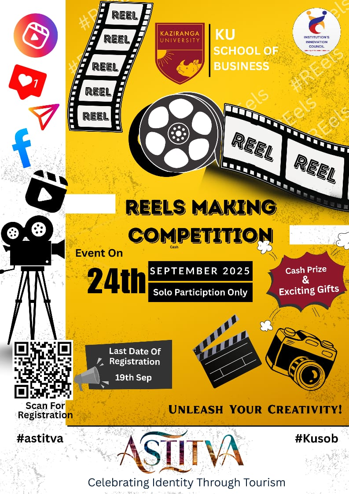
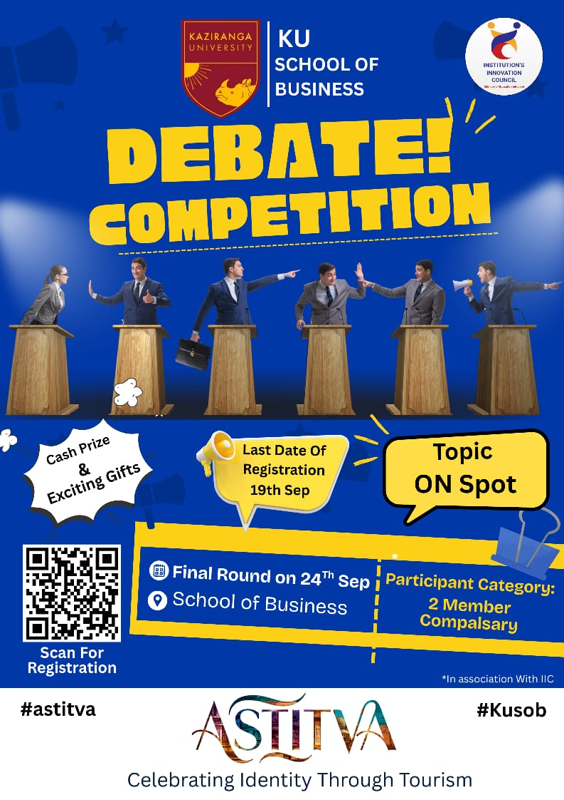
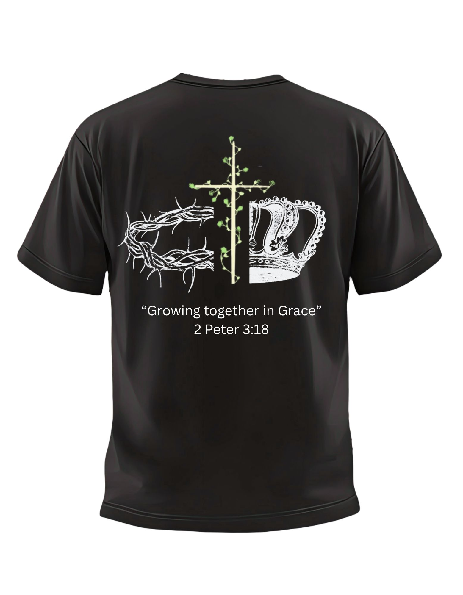
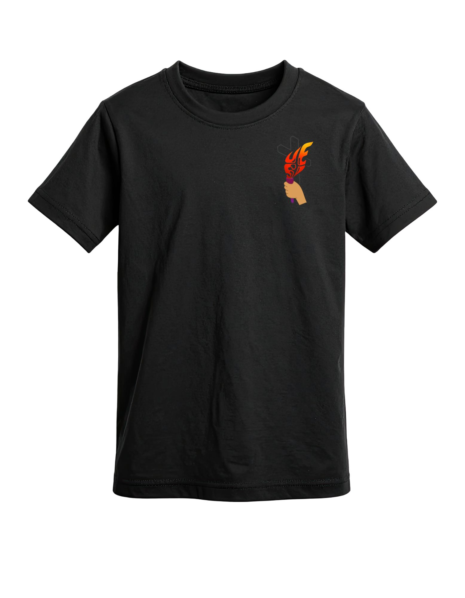
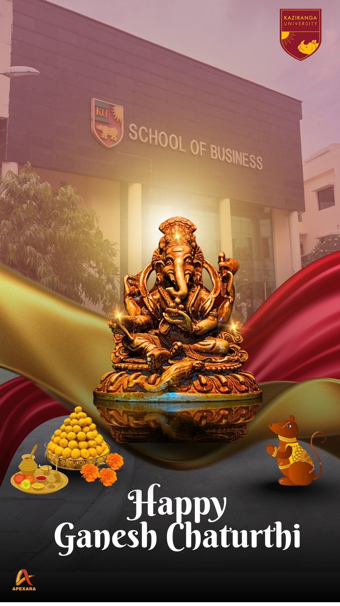

# 📱 Social Media Management Portfolio

## 👤 About Me
I am Subham Das an MBA (Marketing) student with hands-on experience in social media management, content creation, and digital branding. I specialize in growing online presence, creating engaging content, and leveraging data-driven strategies to improve audience engagement.

---

## 💼 Role: Social Media Manager  
**Organization:** Apexara – KU School of Business  

---

## 🚀 Key Achievements
- 📈 Scaled Instagram followers from **150 to 757+**
- 👀 Generated **24K+ views** through strategic content execution
- 📊 Improved audience engagement using data-driven strategies
 .jpeg)
.jpeg)

---

## 📌 Responsibilities & Contributions

### 📊 Content Strategy & Planning
- Developed and implemented **data-driven content strategies**
- Planned content across **reels, posts, and stories**
- Aligned content with **audience preferences and trending topics**

### 🎨 Content Creation
- Designed high-quality creatives using **Canva**
- Produced engaging short-form videos using **CapCut** and **VN**
- Maintained consistency in **brand identity and storytelling**

### 🎥 End-to-End Content Production
- Led complete content workflow:
  - Planning
  - Shooting
  - Editing
  - Publishing
- Created original and engaging content regularly

### 🤝 Collaboration & Growth
- Collaborated with **influencers and campus creators**
- Expanded reach and improved **organic engagement**

### 📅 Content Management
- Maintained structured **content calendars**
- Ensured timely and consistent posting

### 📈 Analytics & Optimization
- Monitored performance using analytics tools
- Continuously optimized strategies based on insights
- Improved engagement metrics through data-driven decisions

---

## 🛠️ Tools & Skills
- **Design:** Canva  
- **Video Editing:** CapCut, VN  
- **Content Strategy:** Trend Analysis, Audience Targeting  
- **Analytics:** Performance Tracking & Optimization  
- **Social Media Platforms:** Instagram  

---

## 📊 Core Skills
- Social Media Management  
- Content Creation & Storytelling  
- Influencer Collaboration  
- Digital Branding  
- Audience Engagement  
- Creative Strategy  

---
## My Work & Results – Instagram Reels

🔗 [Watch My Reel 1](https://www.instagram.com/reel/DWV37QzEfQq/?igsh=aDAwaGR2b2lzZmh3)

🔗 [Watch My Reel 2](https://www.instagram.com/reel/DWRnSZWAH5y/?igsh=cW0wZDRkYml4Z3px)

🔗 [Watch My Reel 3](https://www.instagram.com/reel/DWO3ml_gFU7/?igsh=MXRrd3hlMGd4Nmpleg==)

🔗 [Watch My Reel 4](https://www.instagram.com/reel/DV9DEO9DxHv/?igsh=b3I4dm41a2g2MzR2)

🔗 [Watch My Reel 5](https://www.instagram.com/reel/DQeRY2tj6hQ/?igsh=MTRhNjg3ZGpoajVtaw==)

🔗 [Watch My Reel 6](https://www.instagram.com/reel/DOogrUBEjEe/?igsh=MXE4ejV6enk2dTVkdw==)

🔗 [Watch My Reel 7](https://www.instagram.com/reel/DQcQ1fJEmTr/?igsh=dmU3MGZkdjR1dzgx)

🔗 [Watch My Reel 8](https://www.instagram.com/reel/DHtCNkgTKA9/?igsh=NXA1YTk4OXU3NTY0)

🔗 [Watch My Reel 9](https://www.instagram.com/reel/DHlZwfmPxGq/?igsh=MWd3ZmZwbmxjYzQ2Mg==)

🔗 [Watch My Reel 10](https://www.instagram.com/reel/DJCBa23PTnO/?igsh=MWtvZDdzcGw0bmo1OQ==)

---
 ## Graphic Design Posters
 
 

 
---

## 📌 Conclusion
This experience demonstrates my ability to combine creativity with analytics to build and scale social media presence effectively. I aim to leverage these skills in digital marketing roles to drive impactful brand growth.

---

⭐ *Feel free to explore my work and connect with me!*
